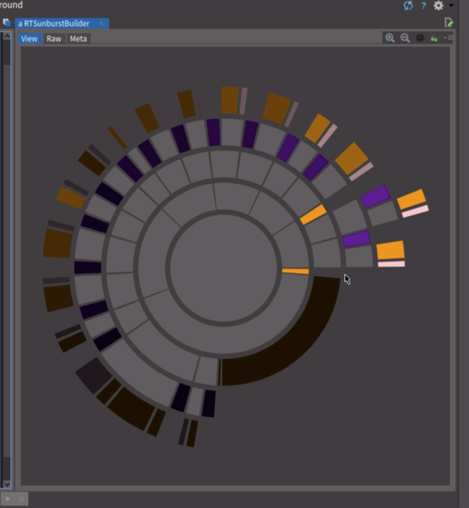

# cmbDirVisualizer

This was my first try in creating a visualizer to look at the content of the zip files that students submitted.

A zip contains a 'readme.txt' and subdirectories containing (by default) C#-projects. Those subdirectories are shown in a circle.

+ Starting from the middle circle (base dir) going to the outside are subdirectories and files.
+ On the right sight: the (bright) colors are are newest files: purple for '*.sln', orange for '.cs'.
+ Going against the clock the colors turn dark when the last modification is older.
+ Clicking on a source file will show the contents of that file.

Created with
+ [Pharo](https://pharo.org/)
+ [Moose](http://moosetechnology.org/)

Now I'm living my
[Glamorous Adventures](https://github.com/coentjo/GlamorousAdventures)
at
[the Glamorous Toolkit](https://gtoolkit.com/)
to enhance the experience...

Please let me know if you're interested! 
